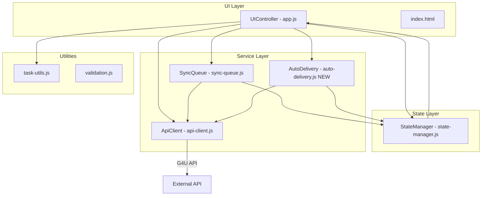

# Design Document: App Enhancements

## Overview

This design describes enhancements to the Factory Task Tracker, a vanilla JS single-page application that communicates with the G4U API. The app currently supports login, task fetching (PENDING/DONE/DELIVERED), optimistic task status updates via a sync queue, and priority-based task rendering.

The enhancements add seven capabilities:
1. Self-assigned action creation via a "+" button
2. Visual distinction and approval flow for self-assigned actions
3. Updated status display (PENDING/DOING in to-do, DONE in completed, no DELIVERED)
4. Auto-delivery of admin-assigned DONE actions on logout
5. Auto-delivery at 18:00 BRT via a scheduled timer
6. User points display (locked/unlocked)
7. Reference folder cleanup

The existing architecture follows a modular pattern: `ApiClient` (api-client.js) handles API communication, `StateManager` (state-manager.js) manages reactive state, `SyncQueue` (sync-queue.js) handles background sync, `task-utils.js` provides pure rendering/sorting functions, and `UIController` (app.js) orchestrates the UI.

## Architecture

The enhancements extend the existing module structure without introducing new frameworks or build tools. All changes remain in vanilla JS with ES modules.



### Key Design Decisions

1. **New `auto-delivery.js` module**: Auto-delivery logic (shared between logout and 18:00 BRT timer) is extracted into its own module to avoid duplicating logic in the logout handler and timer callback. This module exports pure functions for identifying deliverable actions and orchestrating delivery API calls.

2. **Self-assigned marker via comments field**: The `[SELF-ASSIGNED]` string is appended to the comments array when creating a self-assigned action. This reuses the existing comments mechanism (already used for `PRIORITY:X`) and requires no API schema changes.

3. **No DELIVERED fetch**: The current `getTasks()` fetches PENDING, DONE, and DELIVERED. The updated design removes the DELIVERED fetch and adds DOING, querying only `PENDING`, `DOING`, and `DONE`.

4. **Timer uses `setTimeout` with BRT offset**: Rather than a `setInterval`, the 18:00 BRT timer calculates the milliseconds until the next 18:00 BRT and uses `setTimeout`. This avoids drift and handles login-after-18:00 correctly.

## Components and Interfaces

### 1. ApiClient Extensions (api-client.js)

New methods added to the existing `ApiClient` object:

```javascript
/**
 * Fetch available action templates
 * @returns {Promise<Array>} Array of action template objects
 */
async getActionTemplates() → GET /action

/**
 * Create a self-assigned action
 * @param {Object} params - { action_template_id, user_email, comments }
 * @returns {Promise<Object>} Created action
 */
async createSelfAssignedAction(params) → POST /game/action/process
// Payload: { status: "DONE", user_email, action_id, comments: ["[SELF-ASSIGNED]", ...], ... }

/**
 * Complete a delivery
 * @param {string} deliveryId
 * @param {string} finishedAt - ISO 8601 timestamp
 * @returns {Promise<{status: number}>} Response with status code
 */
async completeDelivery(deliveryId, finishedAt) → POST /game/delivery/{deliveryId}/complete
// Body: { finished_at: finishedAt }, Header: client_id

/**
 * Fetch user data (for points)
 * @param {string} userId
 * @returns {Promise<Object>} User data with locked_points, unlocked_points
 */
async getUserData(userId) → GET /user/{userId}
```

### 2. Updated `getTasks()` (api-client.js)

```javascript
// BEFORE: fetches PENDING, DONE, DELIVERED
// AFTER:  fetches PENDING, DOING, DONE only
async getTasks() {
  const [pendingTasks, doingTasks, doneTasks] = await Promise.all([
    this.getTasksByStatus('PENDING'),
    this.getTasksByStatus('DOING'),
    this.getTasksByStatus('DONE')
  ]);
  // ... aggregate without DELIVERED
}
```

### 3. Auto-Delivery Module (auto-delivery.js — NEW)

```javascript
export const AutoDelivery = {
  /**
   * Identify admin-assigned DONE actions completed today
   * @param {Array} tasks - Aggregated task groups from state
   * @returns {Array} Flat array of raw sub-tasks eligible for delivery
   */
  getDeliverableActions(tasks) → filters for:
    - status === 'DONE'
    - NOT self-assigned (no [SELF-ASSIGNED] in comments)
    - finished_at is today (BRT date)

  /**
   * Execute delivery for all eligible actions
   * @param {Array} deliverableActions - Raw sub-tasks to deliver
   * @returns {Promise<{succeeded: number, failed: number, errors: Array}>}
   */
  async executeDeliveries(deliverableActions)

  /**
   * Schedule the 18:00 BRT timer
   * @returns {number} Timer ID for cancellation
   */
  scheduleEndOfDayDelivery() → setTimeout to next 18:00 BRT

  /**
   * Cancel the scheduled timer
   * @param {number} timerId
   */
  cancelScheduledDelivery(timerId)
};
```

### 4. UIController Extensions (app.js)

New UI behaviors:

- **Add button ("+")**:  Rendered in the task list header, triggers action template selection modal
- **Action template selection modal**: Lists templates from `GET /action`, player selects one to create self-assigned action
- **Points display**: A section below the header showing locked/unlocked points
- **Self-assigned badge**: Completed self-assigned actions render with a distinct "Awaiting approval" badge and different background color
- **Logout flow update**: Before clearing state, calls `AutoDelivery.executeDeliveries()`

### 5. StateManager Extensions (state-manager.js)

New state fields:

```javascript
const initialState = {
  // ... existing fields
  userPoints: { locked: 0, unlocked: 0 },  // NEW
  autoDeliveryTimerId: null,                 // NEW
  actionTemplates: [],                       // NEW
  isActionModalOpen: false                   // NEW
};
```

### 6. task-utils.js Extensions

```javascript
/**
 * Check if a task is self-assigned by inspecting comments for [SELF-ASSIGNED] marker
 * @param {Object} task - Raw task object
 * @returns {boolean}
 */
export function isSelfAssigned(task)

/**
 * Render a self-assigned task card with approval badge
 * @param {Object} task - Task object
 * @returns {string} HTML string
 */
// Updated renderTaskCard to handle self-assigned visual distinction
```

Updated `renderTasks` in UIController:
- Active tasks (To-Do): tasks where status is PENDING or DOING
- Completed tasks: tasks where status is DONE
- Self-assigned DONE tasks get "Awaiting approval" badge

## Data Models

### Action Template (from GET /action)

```javascript
{
  id: string,           // action template ID
  title: string,        // display name
  description: string,  // optional description
  points: number,       // points value
  deactivated_at: null  // null = active
}
```

### Self-Assigned Action Creation Payload (POST /game/action/process)

```javascript
{
  status: "DONE",
  user_email: string,
  action_id: string,              // action_template_id
  delivery_id: string,            // generated: "{action_id}_{user_id_prefix}"
  delivery_title: string,         // action title
  created_at: string,             // ISO 8601
  integration_id: string,         // generated unique ID
  comments: ["[SELF-ASSIGNED]"],  // marker for self-assigned identification
  approved: false,
  approved_by: null,
  dismissed: false,
  finished_at: string             // ISO 8601 (now)
}
```

### Delivery Completion Payload (POST /game/delivery/{deliveryId}/complete)

```javascript
{
  finished_at: string  // ISO 8601 timestamp
}
// Header: client_id: "healthgo"
```

### User Points Data (from GET /user/{id})

```javascript
{
  user_id: string,
  full_name: string,
  email: string,
  // ... other fields
  locked_points: number,    // points pending approval
  unlocked_points: number   // confirmed points
}
```

### Updated State Shape

```javascript
{
  isAuthenticated: boolean,
  user: Object | null,
  tasks: Array,                    // aggregated task groups
  isLoading: boolean,
  error: string | null,
  pendingChanges: Array,
  userPoints: {                    // NEW
    locked: number,
    unlocked: number
  },
  autoDeliveryTimerId: number | null,  // NEW
  actionTemplates: Array,              // NEW
  isActionModalOpen: boolean           // NEW
}
```

### Task Classification Logic

```
For each raw sub-task in an aggregated group:
  - isSelfAssigned = comments includes "[SELF-ASSIGNED]"
  - isAdminAssigned = NOT isSelfAssigned

Display rules:
  - PENDING or DOING → To-Do list
  - DONE + isSelfAssigned → Completed list with "Awaiting approval" badge
  - DONE + isAdminAssigned → Completed list (normal)
  - DELIVERED → Not fetched, not displayed

Auto-delivery eligibility:
  - status === "DONE"
  - isAdminAssigned === true
  - finished_at date === today (BRT)
```


## Correctness Properties

*A property is a characteristic or behavior that should hold true across all valid executions of a system — essentially, a formal statement about what the system should do. Properties serve as the bridge between human-readable specifications and machine-verifiable correctness guarantees.*

### Property 1: Self-assigned payload correctness

*For any* action template ID and any user email, the payload generated by `createSelfAssignedAction` must have `status` equal to `"DONE"`, `user_email` equal to the provided email, `action_id` equal to the provided template ID, and `comments` containing the `"[SELF-ASSIGNED]"` marker string.

**Validates: Requirements 1.2, 2.1**

### Property 2: Self-assigned identification

*For any* task object whose `comments` array contains the string `"[SELF-ASSIGNED]"`, `isSelfAssigned(task)` must return `true`. *For any* task object whose `comments` array does not contain `"[SELF-ASSIGNED]"`, `isSelfAssigned(task)` must return `false`.

**Validates: Requirements 2.4**

### Property 3: Self-assigned rendering with approval badge

*For any* task object that is self-assigned and has status `DONE`, the HTML string produced by `renderTaskCard` must contain an "awaiting approval" indicator element (e.g., a badge or label with the text "Awaiting approval").

**Validates: Requirements 2.2, 2.3**

### Property 4: Task list partitioning by status

*For any* array of tasks with mixed statuses (PENDING, DOING, DONE, DELIVERED), when partitioned for display: every task with status PENDING or DOING must appear in the To-Do list, every task with status DONE must appear in the Completed list, and no task with status DELIVERED may appear in either list.

**Validates: Requirements 3.2, 3.3, 3.4**

### Property 5: Deliverable action filtering

*For any* array of task sub-actions, `getDeliverableActions` must return only those where: status is `"DONE"`, the comments do NOT contain `"[SELF-ASSIGNED]"`, and `finished_at` falls on the current day in BRT. No self-assigned action may ever appear in the result.

**Validates: Requirements 4.1, 4.7**

### Property 6: Delivery resilience

*For any* list of N deliverable actions where some subset fails with network errors, `executeDeliveries` must attempt delivery for all N actions (i.e., the number of API calls made equals N regardless of individual failures).

**Validates: Requirements 4.6**

### Property 7: 18:00 BRT timer calculation

*For any* current timestamp, `scheduleEndOfDayDelivery` must compute a delay such that `currentTime + delay` equals the next occurrence of 18:00:00 BRT (UTC-3). If the current time is before 18:00 BRT today, the target is today at 18:00 BRT. If the current time is at or after 18:00 BRT today, the target is tomorrow at 18:00 BRT.

**Validates: Requirements 5.1, 5.3**

### Property 8: Failed delivery error message

*For any* positive integer N representing the count of failed deliveries, the error toast message produced must contain the number N as a substring.

**Validates: Requirements 5.5**

### Property 9: Points display rendering

*For any* pair of non-negative integers (locked, unlocked), the points section HTML must contain both values as visible text content.

**Validates: Requirements 6.2**

### Property 10: Points fallback on network error

*For any* previous points state `{locked: L, unlocked: U}` and a network error on `GET /user/{id}`, the resulting displayed points must equal `{locked: L, unlocked: U}`. If no previous state exists, the result must be `{locked: 0, unlocked: 0}`.

**Validates: Requirements 6.6**

### Property 11: Task list invariant on failed creation

*For any* initial task list state, if a self-assigned action creation API call fails, the task list after the failure must be deeply equal to the task list before the attempt.

**Validates: Requirements 1.4**

## Error Handling

| Scenario | Behavior |
|---|---|
| Self-assigned creation API fails | Show error toast with failure reason; task list unchanged (Property 11) |
| Delivery API returns 200 | Action considered delivered; continue |
| Delivery API returns 204 | Log non-delivery; continue to next action |
| Delivery API network error | Log error; continue to next action (Property 6) |
| GET /user/{id} returns 401 | Trigger session expired flow (clear token, redirect to login) |
| GET /user/{id} returns 404 | Display 0 for both locked and unlocked points |
| GET /user/{id} network error | Display last known points or 0/0 (Property 10) |
| GET /action fails | Show error toast; close action template modal |
| 18:00 BRT delivery partial failure | Show error toast with count of failed deliveries (Property 8) |
| Timer scheduling after 18:00 BRT | Schedule for next day 18:00 BRT (Property 7 edge case) |

## Testing Strategy

### Testing Framework

- **Unit/Integration tests**: Vitest (already configured in the project)
- **Property-based tests**: fast-check (already in devDependencies)
- **Environment**: Node (as configured in vitest.config.js)

### Unit Tests

Unit tests cover specific examples, edge cases, and integration points:

- `isSelfAssigned` with various comment formats (empty array, null, array with marker, array without marker)
- `createSelfAssignedAction` payload structure for a specific template
- `getDeliverableActions` with a known set of tasks (mix of self-assigned, admin-assigned, various dates)
- Timer calculation for specific times (e.g., 10:00 BRT → same day, 19:00 BRT → next day, exactly 18:00 BRT → next day)
- Points display with 401 response → session expired
- Points display with 404 response → zeros
- Delivery API 200 vs 204 handling
- Logout flow sequence (delivery → clear token → reset state)
- Add button visibility when authenticated vs not authenticated
- Task list refresh after successful self-assigned creation

### Property-Based Tests

Each property test runs a minimum of 100 iterations using fast-check and references its design property.

| Property | Test Description | Tag |
|---|---|---|
| P1 | Generate random template IDs and emails, verify payload fields | Feature: app-enhancements, Property 1: Self-assigned payload correctness |
| P2 | Generate random comment arrays (with/without marker), verify identification | Feature: app-enhancements, Property 2: Self-assigned identification |
| P3 | Generate random self-assigned DONE tasks, verify rendered HTML contains badge | Feature: app-enhancements, Property 3: Self-assigned rendering with approval badge |
| P4 | Generate random task arrays with mixed statuses, verify partitioning | Feature: app-enhancements, Property 4: Task list partitioning by status |
| P5 | Generate random task arrays with mixed types/dates, verify filter output | Feature: app-enhancements, Property 5: Deliverable action filtering |
| P6 | Generate random deliverable lists with simulated failures, verify all attempted | Feature: app-enhancements, Property 6: Delivery resilience |
| P7 | Generate random timestamps, verify computed delay targets 18:00 BRT | Feature: app-enhancements, Property 7: 18:00 BRT timer calculation |
| P8 | Generate random positive integers, verify error message contains the number | Feature: app-enhancements, Property 8: Failed delivery error message |
| P9 | Generate random point pairs, verify HTML contains both values | Feature: app-enhancements, Property 9: Points display rendering |
| P10 | Generate random previous points and simulate network error, verify fallback | Feature: app-enhancements, Property 10: Points fallback on network error |
| P11 | Generate random task lists and simulate creation failure, verify list unchanged | Feature: app-enhancements, Property 11: Task list invariant on failed creation |

Each property-based test must be tagged with a comment in the format:
```
// Feature: app-enhancements, Property {N}: {property title}
```

Each correctness property is implemented by a single property-based test. Property tests use fast-check's `fc.assert(fc.property(...))` with `{ numRuns: 100 }` minimum.
